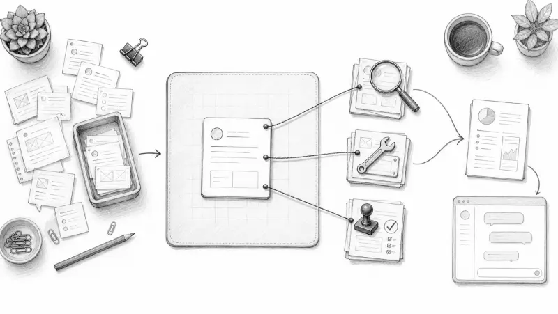
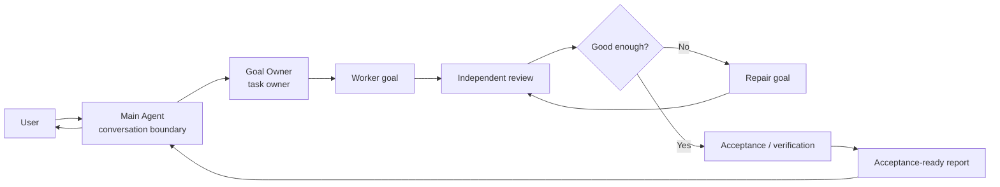
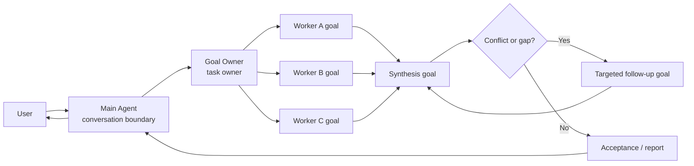
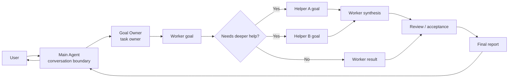

# Parallel Goal Workflows

**[中文说明](README.zh-CN.md)**



`parallel-goal-workflows` is a guidance skill for complex multi-agent work. It
helps the main conversation stay clean while delegated goals run through
planning, focused execution, review, repair, acceptance, and a concise final
handoff.

Invoke it explicitly when a task is too broad, noisy, or risk-sensitive for the
main agent to both coordinate and execute directly.

## Install

```bash
npx skills add patrick-fu/parallel-goal-workflows
```

Update later:

```bash
npx skills update
```

## Quick Use

This is a user-invoked skill. Invoke it with a slash command or `$` command,
then describe the task clearly:

```text
$parallel-goal-workflows

Audit this repository's authentication flow. I want independent exploration,
implementation-risk review, and a final report with evidence, open risks, and
recommended fixes.
```

Mention the goal, scope, constraints, expected evidence, and anything that
requires approval.

## What It Does

The skill turns a broad request into an owned workflow:

- keeps coordination noise out of the main conversation;
- delegates focused work to agents or helpers when useful;
- routes important findings through review and repair;
- checks whether the result satisfies the original goal;
- returns a concise report with evidence and remaining risks.

The workflow can be small. It does not force parallelism when a single focused
agent is enough.

## When To Use It

Good fits include:

- codebase audits or cross-checked research;
- multi-step implementation work that needs independent review;
- long-running tasks where intermediate logs would flood the main context;
- review and repair loops where the final decision matters more than every
  intermediate detail;
- broad tasks that benefit from multiple focused agents working under one goal
  owner.

Avoid it for quick edits, simple research, ordinary code review, or tasks where
you want to stay directly in the main conversation.

## How It Works

Internally, each agent has a clear job:

- **Main Agent:** stays user-facing, interprets each delegated top-level goal,
  turns it into a clean local brief, starts one Goal Owner for that goal, tracks
  active owners, and relays final handoffs.
- **Goal Owner:** owns decomposition, execution coordination, review, repair,
  acceptance, and final judgment.
- **Focused agents or helpers:** own local goals only, work from the local brief
  they receive, and return evidence, verification, risks, or decisions for the
  current assigned goal. Nested helper work must be narrower than its parent
  task and independently verifiable.

Child agent roles are examples, not a fixed type list. A workflow may use
workers, reviewers, verifiers, researchers, explorers, implementers, domain
specialists, or other focused helpers as the task warrants.

The Main Agent and Goal Owner should send natural local briefs, not raw user
prompts or role-chain contracts. Every delegated task should carry a local goal,
relevant context, boundaries, expected deliverable, verification needs, and pause
conditions. Visible briefs should not expose the Main Agent, parent identity,
`Workflow Owner` role labels, skill triggers, raw transcripts, SKILL.md body
text, UI-only directives, or the delegation chain that created the assignment.
A host-required `/goal` prefix may appear as the first line of a delegated
packet when it is needed to enter goal mode. Treat that as runtime syntax, not
task context.

The Main Agent waits on workflow state, not output volume, and acts on done,
blocked, needs-human, failed or dead sessions, and explicit user requests
instead of reclaiming work because a task is quiet.
If a new independent workflow task arrives while another owner is still running,
the Main Agent starts another Goal Owner and tracks both until each reaches
done, blocked, or needs-human.

## Workflow Shapes

The Goal Owner chooses the shape that fits the task. These are examples, not
scripts.

### Review And Repair



### Parallel Synthesis



### Nested Helpers



## Requirements

The best experience uses a host that supports explicit skill invocation, goals,
and subagents.

- **Claude Code:** invoke with `/parallel-goal-workflows`. The skill sets
  `disable-model-invocation: true` so Claude Code should not select it
  automatically or preload it into subagents. Nested subagents are supported in
  Claude Code v2.1.172 and newer, up to 5 levels deep.
- **OpenAI Codex:** invoke with `$parallel-goal-workflows`. The bundled
  `agents/openai.yaml` sets `policy.allow_implicit_invocation: false` so Codex
  should not select it implicitly. Codex supports `agents.max_depth` for nested
  spawned agents.

When the host supports history forking, start assigned agents from clean context
instead of forwarding the full main conversation. For Codex, that means using
`fork_context: false` when the spawn tool exposes it.

When Codex-style prompt delegation requires a visible command to enter goal mode,
start Goal Owner and helper prompts with `/goal` on its own first line, followed
by the natural local brief. Do not pass `$parallel-goal-workflows` to delegated
agents.

A practical Codex configuration is:

```toml
[agents]
max_threads = 50
max_depth = 5

[features]
multi_agent = true
goals = true
```

For more detail, see
[`references/codex-nested-subagents.md`](references/codex-nested-subagents.md).

## More Skills

For more reusable agent skills, see
[Awesome Skills](https://github.com/patrick-fu/awesome-skills).
