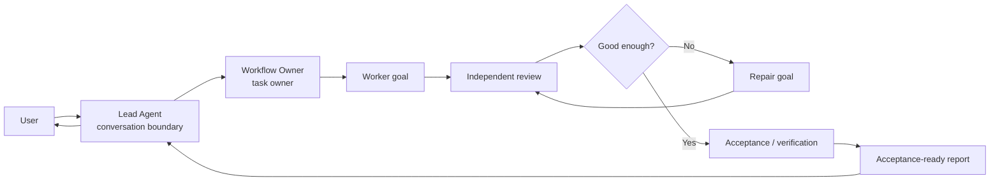
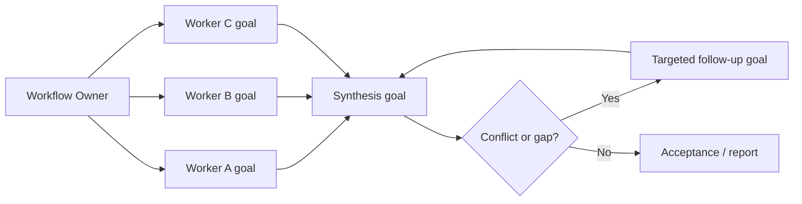
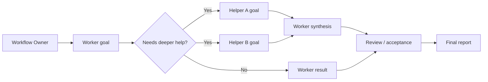

# Parallel Goal Workflows

**[中文说明](README.zh-CN.md)**

`parallel-goal-workflows` is a guidance skill for complex multi-agent work. It
helps the main conversation stay clean while a delegated workflow runs through
planning, focused execution, review, repair, acceptance, and a concise final
handoff.

Use it when a task is too broad, noisy, or risk-sensitive for the main agent to
both coordinate and execute directly.

## Install

```bash
npx skills add patrick-fu/parallel-goal-workflows
```

Update later:

```bash
npx skills update
```

## Quick Use

Invoke the skill with a slash command or `$` command, then describe the task
clearly:

```text
$parallel-goal-workflows

Audit this repository's authentication flow. I want independent exploration,
implementation-risk review, and a final report with evidence, open risks, and
recommended fixes.
```

Mention the goal, scope, constraints, expected evidence, and anything that
requires approval.

## What It Does

The skill turns a broad request into an owned workflow:

- keeps coordination noise out of the main conversation;
- delegates focused work to agents or helpers when useful;
- routes important findings through review and repair;
- checks whether the result satisfies the original goal;
- returns a concise report with evidence and remaining risks.

The workflow can be small. It does not force parallelism when a single focused
agent is enough.

## When To Use It

Good fits include:

- codebase audits or cross-checked research;
- multi-step implementation work that needs independent review;
- long-running tasks where intermediate logs would flood the main context;
- review and repair loops where the final decision matters more than every
  intermediate detail;
- broad tasks that benefit from multiple focused agents working under one
  workflow owner.

Avoid it for quick edits, simple research, ordinary code review, or tasks where
you want to stay directly in the main conversation.

## How It Works

Internally, the lead agent hands the task to a Workflow Owner. The Workflow
Owner is responsible for decomposition, execution coordination, review, repair,
acceptance, and final judgment.

Child agent roles are examples, not a fixed type list. A workflow may use
workers, reviewers, verifiers, researchers, explorers, implementers, domain
specialists, or other focused helpers as the task warrants.

Every delegated task should carry a local goal, relevant context, boundaries,
expected deliverable, verification needs, and pause conditions.

## Workflow Shapes

The Workflow Owner chooses the shape that fits the task. These are examples,
not scripts.

### Review And Repair



### Parallel Synthesis



### Nested Helpers



## Requirements

The best experience uses a host that supports goals and subagents.

- **Claude Code:** skills can be invoked directly with `/skill-name`; nested
  subagents are supported in Claude Code v2.1.172 and newer, up to 5 levels
  deep.
- **OpenAI Codex:** skills can be invoked with `$skill-name`; Codex supports
  `agents.max_depth` for nested spawned agents.

A practical Codex configuration is:

```toml
[agents]
max_threads = 50
max_depth = 5

[features]
multi_agent = true
goals = true
```

For more detail, see
[`references/codex-nested-subagents.md`](references/codex-nested-subagents.md).

## More Skills

For more reusable agent skills, see
[Awesome Skills](https://github.com/patrick-fu/awesome-skills).
