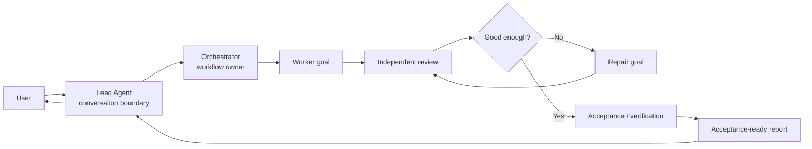
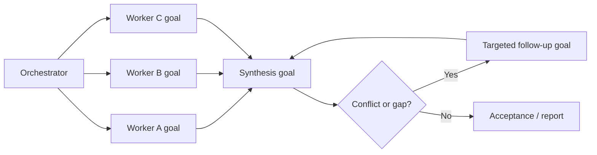
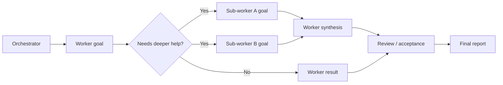

# Parallel Goal Workflows

**[中文说明](README.zh-CN.md)**

`parallel-goal-workflows` is a guidance skill for deliberate multi-agent
workflows. It helps a lead agent hand workflow ownership to an orchestrator,
wait instead of taking delegated work back, and receive an acceptance-ready
report rather than every intermediate detail.

## Install

```bash
npx skills add patrick-fu/parallel-goal-workflows
```

Update later:

```bash
npx skills update
```

## Quick Use

This skill is intentionally high-overhead. Name it explicitly when you want the
Lead / Orchestrator boundary:

```text
Use parallel-goal-workflows for this task. The Lead Agent should start an
Orchestrator, wait instead of doing task-level work, and report back only after
the Orchestrator returns an acceptance-ready result.
```

## What It Does

The skill turns a broad delegated task into an orchestrator-owned workflow:

- the Lead Agent owns the user conversation and final handoff;
- the Orchestrator owns task decomposition, scheduling, review, acceptance,
  repair routing, and task-level judgment;
- Worker, Review, Acceptance, Repair, and Synthesis agents each receive focused
  goals;
- every spawned agent uses native Goal mode when available, or a goal-shaped
  delegation packet when native per-subagent goals are unavailable;
- the Lead waits with callback-style patience instead of polling, interrupting,
  or restarting delegated work;
- downstream agents may delegate further when the host supports nested
  subagents.

The goal is context, not control. This skill gives agents ownership boundaries
and completion signals while leaving the workflow owner room to adapt.

## When To Use It

Use this skill when the task is worth a deliberate orchestration layer and you
do not want the main conversation to become the coordination workspace.

Good fits include:

- parallel code review, codebase audits, or cross-checked research;
- multi-step implementation plans that need independent workers and review;
- long-running command or subagent work where the lead might otherwise poll,
  interrupt, or restart too aggressively;
- review and repair loops where the main context should only receive the final
  decision and evidence;
- nested subagent workflows where a worker may need its own workers.

Do not use it as the default for ordinary coding, research, review, simple
parallel exploration, or generic goal decomposition.

## Goal-First Coordination

Every participating agent should start from a goal, not a vague chore:

- Lead goal: preserve the conversation boundary and wait for the orchestrator's
  acceptance-ready report.
- Orchestrator goal: own decomposition, scheduling, review, acceptance, repair,
  and final reporting.
- Downstream goals: give each Worker, Review, Acceptance, Repair, and Synthesis
  agent one concrete outcome, expected evidence, boundaries, and pause
  conditions.

When the host exposes native Goal mode for the relevant session or thread, use
it. When a runtime does not expose per-subagent Goal mode, put the same goal
packet in the delegation message.

## Workflow Shapes

The orchestrator chooses the shape that fits the task. These are examples, not
scripts.

### Orchestrated Review



### Parallel Synthesis



### Nested Delegation



## Why It Helps

**Prevents Lead Agent takeover.** Main agents often struggle to stay in
observation mode after delegation. This skill gives the Lead its own boundary
goal: start the orchestrator, wait, relay clarifications, and report back
without becoming the hidden worker.

**Keeps coordination noise out of the main context.** Review findings, repair
loops, acceptance checks, and intermediate disagreements stay inside the
orchestrated workflow. The Lead receives the final report, evidence, and risks.

**Stays flexible.** The skill is not a workflow script. It keeps coordination in
agent goals and ownership boundaries so the orchestrator can choose the shape
that fits the task.

## Requirements

For the full workflow, the host environment should support native Goal mode
where available and multi-level subagents when nested delegation is needed.

- **Codex:** check the [Codex subagents docs](https://developers.openai.com/codex/subagents)
  and [config basics](https://developers.openai.com/codex/config-basic). Codex
  documents Goal mode and says to enable `features.goals` if `/goal` is not
  visible. It also documents `agents.max_depth` as the spawned-agent nesting
  depth and notes that the default `max_depth = 1` prevents deeper nesting. A
  practical starting point is:

  ```toml
  [agents]
  max_threads = 50
  max_depth = 5

  [features]
  multi_agent = true
  goals = true
  ```

- **Claude Code:** use version `2.1.172` or newer for nested subagents. The
  official [Claude Code changelog](https://code.claude.com/docs/en/changelog#2-1-172)
  says v2.1.172 added sub-agents spawning their own sub-agents, up to 5 levels
  deep. Claude Code's `/goal` requires `2.1.139` or newer, but the public
  subagent configuration docs do not document a per-subagent `goal` field. Use
  native `/goal` for Claude sessions that expose it; for named subagents, pass
  the goal packet in the delegation prompt unless your runtime exposes a native
  per-subagent goal control.

  ```bash
  claude --version
  ```

## More Skills

For more reusable agent skills, see
[Awesome Skills](https://github.com/patrick-fu/awesome-skills).
