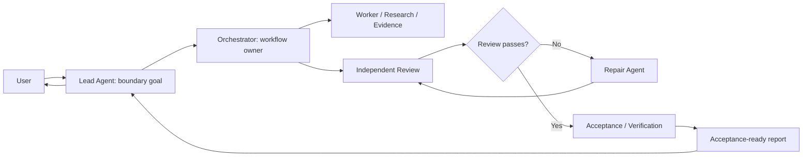
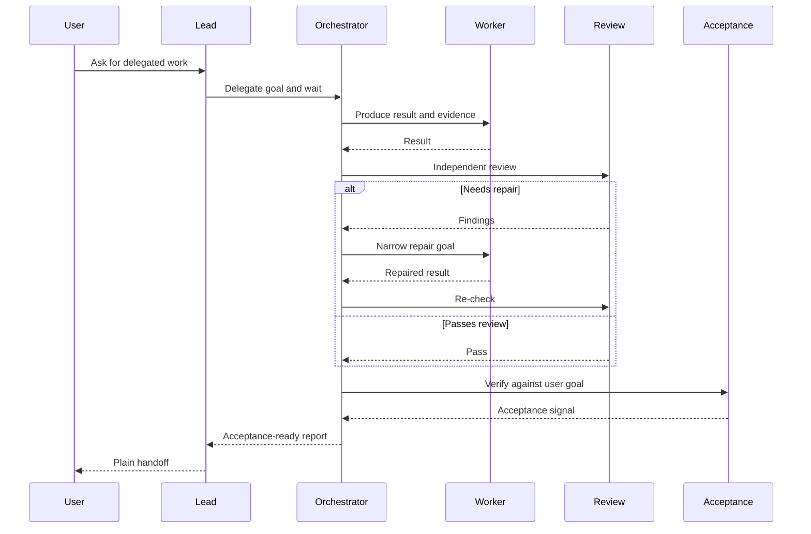

# Parallel Goal Workflows

**[中文说明](README.zh-CN.md)**

`parallel-goal-workflows` is an agent skill for goal-driven multi-agent work. It
guides a lead agent to start an orchestrator, hold a conversation-level boundary
goal, wait with callback-style patience, and report back while the orchestrator
coordinates workers, review, acceptance, and repair.

## Highlights

### 1. Keeps the Lead Agent from taking work back

Main agents often struggle to stay idle after they delegate. After spawning a
subagent or launching a long-running command, they may start doing the same work
themselves, poll progress too frequently, stop slow commands, or close and
restart subagents at the first sign of friction.

This skill directly targets that behavior. The Lead Agent gets its own
conversation-level boundary goal: start the orchestrator, wait with
callback-style patience, and report back without becoming the hidden worker.

### 2. Uses an Orchestrator to isolate review and acceptance noise

In many subagent workflows, the Main Agent still absorbs the cost of reviewing
worker output, running acceptance checks, deciding whether repair is needed, and
summarizing every intermediate detail. That burns the main context window.

This skill moves delegation, review, acceptance, and repair routing into a
second-level subagent: the Orchestrator. The Lead Agent receives an
acceptance-ready report instead of every noisy intermediate step.

### 3. Designed for multi-level subagents

For the full workflow, enable nested subagents in your host environment.

- **Codex:** check the [Codex subagents docs](https://developers.openai.com/codex/subagents)
  and [config basics](https://developers.openai.com/codex/config-basic). Codex
  documents `agents.max_depth` as the spawned-agent nesting depth and notes that
  the default `max_depth = 1` prevents deeper nesting. A practical starting
  point is:

  ```toml
  [agents]
  max_threads = 50
  max_depth = 5

  [features]
  multi_agent = true
  ```

- **Claude Code:** use version `2.1.172` or newer. The official
  [Claude Code changelog](https://code.claude.com/docs/en/changelog#21172) says
  v2.1.172 added sub-agents spawning their own sub-agents, up to 5 levels deep.
  Check your local version with:

  ```bash
  claude --version
  ```

## Install

```bash
npx skills add patrick-fu/parallel-goal-workflows
```

To update later:

```bash
npx skills update
```

## What It Helps With

- delegated workflows where the lead should not become a hidden worker
- fan-out / fan-in agent work with independent review
- orchestrator-owned acceptance and repair loops
- nested subagent workflows when the host environment supports them
- Codex and Claude Code configuration guidance for nested subagents

## Workflow Shape



## Review And Repair Loop



## Included Skill

- `parallel-goal-workflows`

## Notes

The skill is intentionally guidance-first. It provides context and ownership
patterns rather than a rigid script for how every agent must behave.
