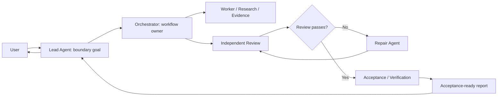
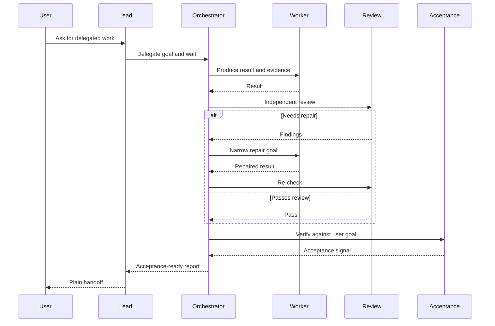

# Parallel Goal Workflows

**[中文说明](README.zh-CN.md)**

`parallel-goal-workflows` is an agent skill for goal-driven multi-agent work. It
guides a lead agent to start an orchestrator, hold a conversation-level boundary
goal, wait with callback-style patience, and report back while the orchestrator
coordinates workers, review, acceptance, and repair.

## Install

```bash
npx skills add patrick-fu/parallel-goal-workflows
```

To update later:

```bash
npx skills update
```

## What It Helps With

- delegated workflows where the lead should not become a hidden worker
- fan-out / fan-in agent work with independent review
- orchestrator-owned acceptance and repair loops
- nested subagent workflows when the host environment supports them
- Codex configuration guidance for nested subagents

## Workflow Shape



## Review And Repair Loop



## Included Skill

- `parallel-goal-workflows`

## Notes

The skill is intentionally guidance-first. It provides context and ownership
patterns rather than a rigid script for how every agent must behave.
