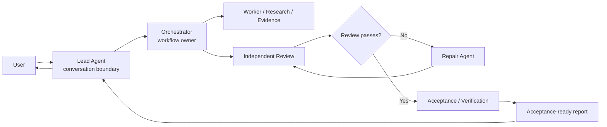
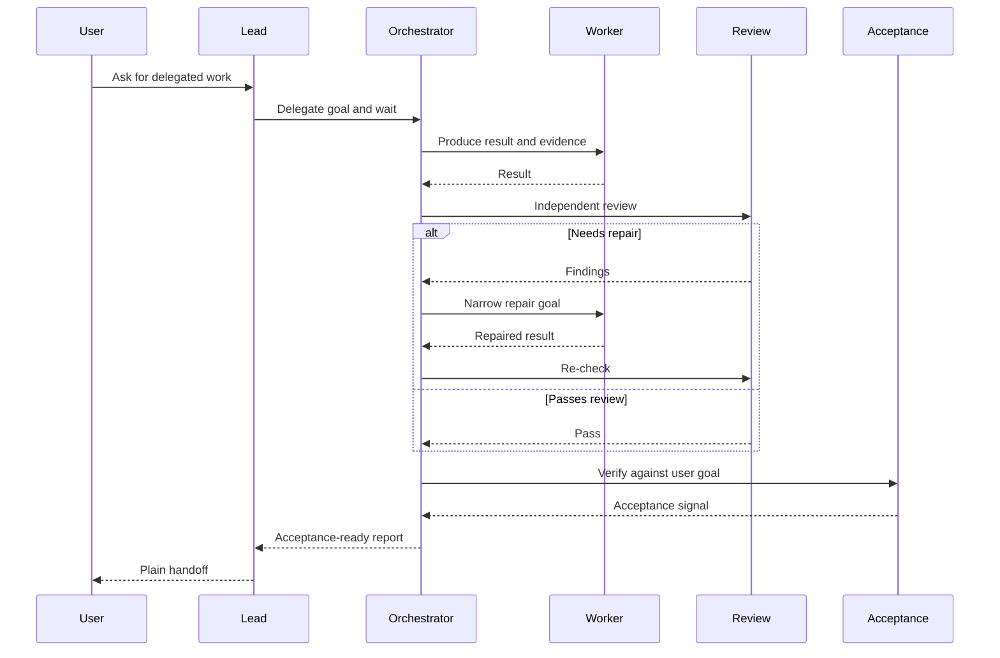

# Parallel Goal Workflows

**[中文说明](README.zh-CN.md)**

`parallel-goal-workflows` is a guidance skill for delegated, multi-agent work.
It helps a lead agent hand workflow ownership to an orchestrator, stay out of
task-level execution, and receive an acceptance-ready report instead of every
intermediate detail.

## What It Does

This skill turns a broad delegated task into an orchestrator-owned workflow:

- the Lead Agent owns the user conversation and final handoff;
- the Orchestrator owns task decomposition, scheduling, review, acceptance, and
  repair routing;
- Worker, Review, Acceptance, Repair, and Synthesis agents each receive focused
  goals;
- the Lead waits with callback-style patience instead of polling or taking work
  back;
- worker agents may delegate further when the host environment supports nested
  subagents.

The goal is context, not control. The skill does not prescribe a rigid script.
It gives agents enough ownership boundaries to coordinate well while leaving
room for the workflow owner to adapt.

## When To Use It

Use this skill when a task benefits from delegated agents but you do not want
the main conversation to become the coordination workspace.

Good fits include:

- parallel code review, codebase audits, or cross-checked research;
- multi-step implementation plans that need independent workers and review;
- long-running command or subagent work where the lead might otherwise poll,
  interrupt, or restart too aggressively;
- review and repair loops where the main context should only receive the final
  decision and evidence;
- nested subagent workflows where a worker may need its own workers.

## Workflow Shape



## Review And Repair Loop



## Why It Helps

### Keeps the Lead Agent from retaking delegated work

Main agents often struggle to remain in observation mode after delegation. After
spawning a subagent or launching a long-running command, they may start doing
the same work themselves, poll too frequently, stop slow commands, or close and
restart subagents at the first sign of friction.

This skill gives the Lead Agent its own boundary goal: start the orchestrator,
wait with callback-style patience, relay user updates when needed, and report
back without becoming the hidden worker.

### Uses the Orchestrator as a context buffer

In a normal subagent workflow, the Main Agent often still absorbs review,
acceptance, repair decisions, and noisy intermediate findings. That burns the
main context window.

Here, a second-level Orchestrator absorbs that work. The Lead gets the final
report, supporting evidence, and remaining risks, while the messy coordination
stays inside the delegated workflow.

### Preserves flexible orchestration

Dynamic workflow systems often move the plan into code so the runtime can run
large repeatable fan-outs. This skill is deliberately lighter: it keeps the plan
in agent goals and ownership boundaries. Use it when you want a reusable
coordination preference rather than a generated workflow script.

## Requirements

For the full nested workflow, the host environment must support multi-level
subagents.

- **Codex:** check the [Codex subagents docs](https://developers.openai.com/codex/subagents)
  and [config basics](https://developers.openai.com/codex/config-basic). Codex
  documents `agents.max_depth` as the spawned-agent nesting depth and notes that
  the default `max_depth = 1` prevents deeper nesting. A practical starting
  point is:

  ```toml
  [agents]
  max_threads = 50
  max_depth = 5

  [features]
  multi_agent = true
  ```

- **Claude Code:** use version `2.1.172` or newer. The official
  [Claude Code changelog](https://code.claude.com/docs/en/changelog#2-1-172)
  says v2.1.172 added sub-agents spawning their own sub-agents, up to 5 levels
  deep. Check your local version with:

  ```bash
  claude --version
  ```

## Install

```bash
npx skills add patrick-fu/parallel-goal-workflows
```

To update later:

```bash
npx skills update
```

## Included Skill

- `parallel-goal-workflows`

## More Skills

For more reusable agent skills, see
[Awesome Skills](https://github.com/patrick-fu/awesome-skills). It includes
skills for brainstorming, coding-agent delegation, code review, commit
messages, goal contracts, learning coaching, home config sync, and
log-driven debugging.

## Related Reading

- [Codex subagents](https://developers.openai.com/codex/subagents)
- [Codex config basics](https://developers.openai.com/codex/config-basic)
- [Claude Code dynamic workflows](https://code.claude.com/docs/en/workflows)
- [Claude Code changelog](https://code.claude.com/docs/en/changelog#2-1-172)
- [Anthropic: Building Effective Agents](https://www.anthropic.com/engineering/building-effective-agents)
