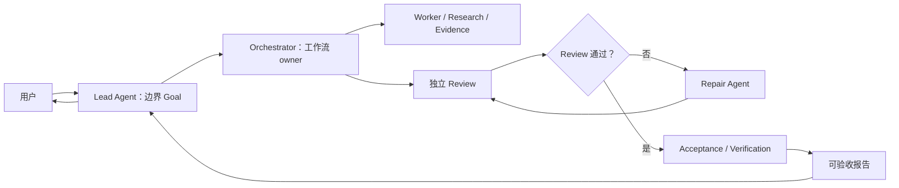
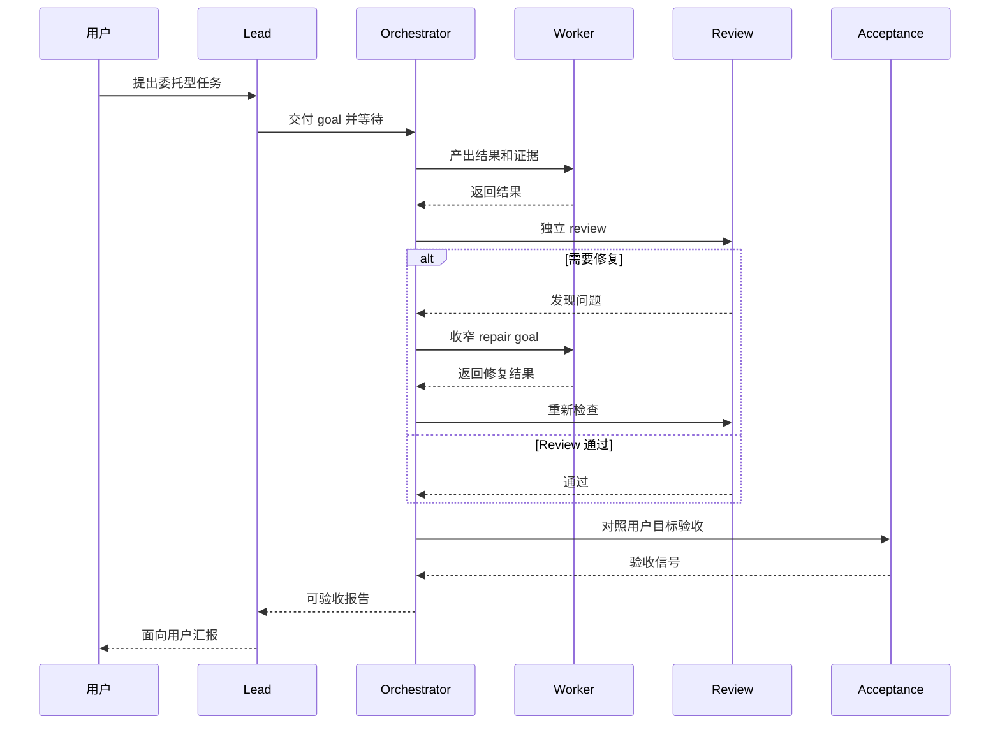

# Parallel Goal Workflows

**[English README](README.md)**

`parallel-goal-workflows` 是一个面向多 Agent 协作的 Skill。它引导 Lead
Agent 启动 Orchestrator，持有会话层面的边界 Goal，以接近 callback 的节奏等待，
并在 Orchestrator 负责 worker、review、acceptance 和 repair 后向用户汇报。

## 亮点

### 1. 抑制 Main Agent 抢占工作的倾向

Main Agent 在派发 Sub Agent 任务，或者启动长时间运行的命令后，经常很难保持等待。
它可能会忍不住亲自做同一件事、频繁轮询进度，或者一看到命令/Sub Agent 响应稍慢，
就倾向于停止、关闭并重来。

这个 Skill 正是为了解决这种行为倾向。Lead Agent 会持有自己的会话层边界 Goal：
启动 Orchestrator，以接近 callback 的节奏等待，最后只负责向用户汇报，而不是变成隐藏
worker。

### 2. 用 Orchestrator 隔离 review 和验收噪声

在常规 Sub Agent 工作流里，Main Agent 往往仍然要承担大量 review、验收、判断是否
repair、汇总中间细节等工作。这些内容会持续侵占主上下文窗口。

这个 Skill 的核心亮点是把委派、review、验收和 repair 路由交给二级 Sub Agent，也就是
Orchestrator。Lead Agent 最终只接收一份可验收报告，而不是把所有中间噪声都装进自己的
上下文。

### 3. 面向多层级 Sub Agent

要完整发挥这个 Skill 的效果，请确保宿主环境已经开启多级 Sub Agent 能力。

- **Codex：**参考 [Codex subagents 文档](https://developers.openai.com/codex/subagents)
  和 [config basics](https://developers.openai.com/codex/config-basic)。Codex 文档说明
  `agents.max_depth` 控制 spawned agent 的嵌套深度，并且默认 `max_depth = 1` 会阻止更深层级的嵌套。
  一个实用的起始配置是：

  ```toml
  [agents]
  max_threads = 50
  max_depth = 5

  [features]
  multi_agent = true
  ```

- **Claude Code：**请使用 `2.1.172` 或更新版本。官方
  [Claude Code changelog](https://code.claude.com/docs/en/changelog#21172) 明确写明
  v2.1.172 开始支持 sub-agents 再 spawn 自己的 sub-agents，最多 5 层。可以这样检查本地版本：

  ```bash
  claude --version
  ```

## 安装

```bash
npx skills add patrick-fu/parallel-goal-workflows
```

后续更新：

```bash
npx skills update
```

## 适用场景

- Lead 不应该变成隐藏 worker 的委托工作流
- fan-out / fan-in 形式的并行 Agent 工作和独立 review
- 由 Orchestrator 负责验收和 repair loop
- 宿主环境支持时的嵌套 subagent workflow
- Codex 和 Claude Code nested subagents 的配置建议

## 工作流形态



## Review 和 Repair Loop



## 包含的 Skill

- `parallel-goal-workflows`

## 说明

这个 Skill 刻意保持指导性：它提供上下文和职责边界，而不是把每个 Agent 的行为写成
刚性脚本。
