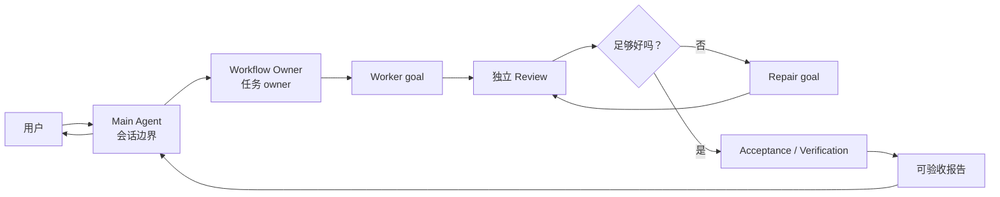
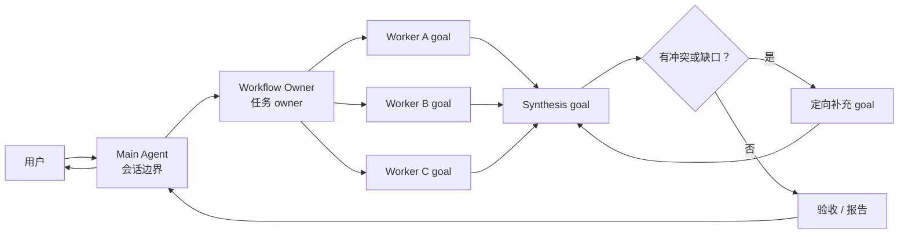
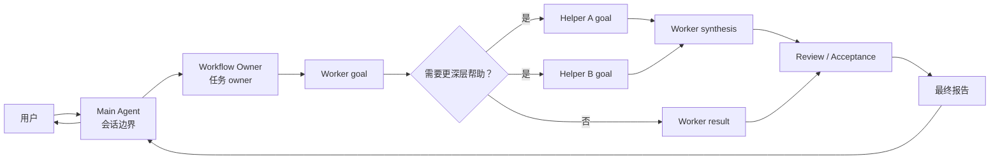

# Parallel Goal Workflows

**[English README](README.md)**


`parallel-goal-workflows` 是一个面向复杂多 Agent 工作的指导型 Skill。它让主会话保持清爽，
把复杂任务交给一个被委派的工作流去完成规划、聚焦执行、review、repair、acceptance 和最终汇报。

当任务过宽、噪声太多，或者风险较高，不适合由主 Agent 一边协调一边直接执行时，显式调用它。

## 安装

```bash
npx skills add patrick-fu/parallel-goal-workflows
```

后续更新：

```bash
npx skills update
```

## 快速使用

这是一个 user-invoked Skill。用 slash command 或 `$` command 调用它，然后把任务描述清楚：

```text
$parallel-goal-workflows

审计这个仓库的认证流程。我希望有独立探索、实现风险 review，并最终给我一份包含证据、
未解决风险和推荐修复方案的报告。
```

说明目标、范围、约束、期望证据，以及哪些事情需要你批准。

## 它能做什么

这个 Skill 会把一个宽泛请求变成有 owner 的工作流：

- 把协调噪声留在主会话之外；
- 在有价值时把聚焦任务委派给 agents 或 helpers；
- 对重要发现做 review 和 repair；
- 检查结果是否满足原始目标；
- 返回一份包含证据和剩余风险的简洁报告。

工作流可以很小。一个聚焦 agent 足够时，它不会强行并行。

## 什么时候使用

典型场景包括：

- 代码库审计或交叉验证式 research；
- 需要独立 review 的多步骤实现任务；
- 长时间任务，且中间日志不适合塞进主上下文；
- review / repair loop 很重要，而你更关心最终判断而不是每个中间细节；
- 宽泛任务，需要多个聚焦 agent 在一个 workflow owner 下协作。

不适合用于快速小改、简单调研、普通 code review，或你希望主会话直接参与每一步的任务。

## 工作方式

内部实现上，每个 Agent 都有清晰职责：

- **Main Agent：** 面向用户，理解用户原始需求，把需求转化成清晰的任务合约，启动一个
  Workflow Owner，观察进度，并转交最终汇报。
- **Workflow Owner：** 负责拆解、执行协调、review、repair、acceptance 和最终判断。
- **聚焦 agents 或 helpers：** 只负责局部目标，根据收到的任务包工作，并把证据、验证结果、
  风险或决策报告给 Workflow Owner。

子 Agent 的角色只是例子，不是固定类型列表。一个工作流可以按需使用 worker、reviewer、
verifier、researcher、explorer、implementer、领域专家或其他聚焦 helper。

Main Agent 和 Workflow Owner 应该发送整理后的任务包，而不是原样转发用户 prompt。每个被委派出去的
任务都应该带有局部目标、相关上下文、边界、期望交付物、验证要求和暂停条件。
Main Agent 等待的是 workflow state，而不是输出量；只有在 blocked 或 needs-human 信号出现时才介入，
不能因为任务安静就重新接管工作。

## 工作流形态

Workflow Owner 会根据任务选择合适的形态。下面这些是示例，不是脚本。

### Review And Repair



### 并行综合



### 嵌套 Helpers



## 使用要求

最佳体验需要宿主环境支持显式 Skill 调用、goals 和 subagents。

- **Claude Code:** 使用 `/parallel-goal-workflows` 调用。这个 Skill 设置了
  `disable-model-invocation: true`，因此 Claude Code 不应自动选择它，也不应把它预加载到
  subagents。Claude Code v2.1.172 及更新版本支持最多 5 层嵌套 subagent。
- **OpenAI Codex:** 使用 `$parallel-goal-workflows` 调用。随附的 `agents/openai.yaml` 设置了
  `policy.allow_implicit_invocation: false`，因此 Codex 不应隐式选择它。Codex 支持通过
  `agents.max_depth` 配置嵌套 spawned agents。

实用的 Codex 配置：

```toml
[agents]
max_threads = 50
max_depth = 5

[features]
multi_agent = true
goals = true
```

更多细节见
[`references/codex-nested-subagents.md`](references/codex-nested-subagents.md)。

## 更多 Skills

更多可复用的 Agent Skills 可以看
[Awesome Skills](https://github.com/patrick-fu/awesome-skills/blob/main/README.zh-CN.md)。
