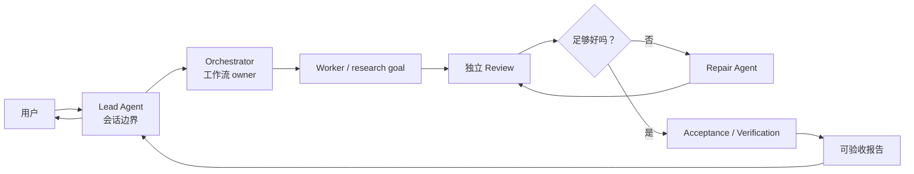
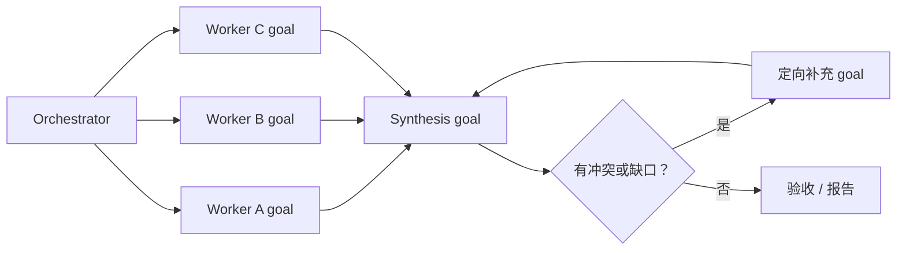
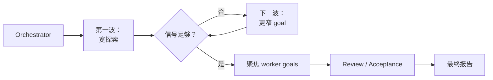
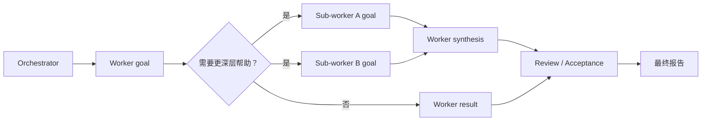

# Parallel Goal Workflows

**[English README](README.md)**

`parallel-goal-workflows` 是一个面向多 Agent 委托工作的指导型 Skill。它帮助
Lead Agent 把工作流所有权交给 Orchestrator，自己留在会话边界上，避免亲自下场执行，
并最终接收一份可验收报告，而不是吞下所有中间细节。

## 安装

```bash
npx skills add patrick-fu/parallel-goal-workflows
```

确认安装：

```bash
test -f ~/.agents/skills/parallel-goal-workflows/SKILL.md
```

后续更新：

```bash
npx skills update
```

## 快速使用

这个 Skill 是有意设计的高开销工作流。需要 Lead / Orchestrator 边界时，建议显式点名：

```text
请使用 parallel-goal-workflows 处理这个任务。Lead Agent 应该启动 Orchestrator，
自己只等待和汇报，不做任务级执行；等 Orchestrator 返回可验收结果后再向我汇报。
```

## 最小 Orchestrator Goal Packet

```text
/goal Orchestrate this delegated workflow to completion and return an
acceptance-ready report.

Context:
[用户目标、约束、相关项目规则和质量标准。]

Deliverable:
[Worker 结果、独立 review 结果、acceptance 或 verification 结果、必要的 repair loop、
最终判断、剩余风险，以及 Lead 可以直接转述的简洁报告。]

Pause if:
[需要凭证、破坏性操作、外部审批、用户判断，或遇到重复阻塞。]
```

## 它能做什么

这个 Skill 会把一个宽泛的委托任务变成 Orchestrator 负责的工作流：

- Lead Agent 只负责用户会话和最终汇报；
- Orchestrator 负责拆解任务、调度、review、验收和 repair 路由；
- Worker、Review、Acceptance、Repair、Synthesis 等 Agent 分别拿到聚焦的 goal；
- 每一个被派生出来的 Agent 都使用明确的 goal：宿主支持时使用原生 Goal mode，否则使用
  goal-shaped delegation packet 来明确完成条件；
- Lead 以接近 callback 的节奏等待，而不是频繁轮询或把工作抢回来；
- 在宿主环境支持嵌套 subagent 时，worker agent 可以按需继续向下委派。

核心思路是 context, not control。这个 Skill 不是刚性脚本，而是给 Agent 足够清晰的
职责边界，让工作流 owner 能根据任务实际情况灵活组织执行。

## 什么时候使用

当任务适合交给多个 Agent、且值得使用有意设计的高开销委派工作流时，可以使用这个 Skill；
它不是普通编码、调研、review、简单并行探索或泛泛 goal decomposition 的默认模式。

典型场景包括：

- 并行 code review、代码库审计、交叉验证式 research；
- 需要独立 worker 和 review 的多步骤实现计划；
- 长时间命令或 Sub Agent 工作，Lead 容易频繁轮询、打断或重启；
- review 和 repair loop 很重要，但主上下文只应该接收最终判断和证据；
- worker 可能还需要继续派生下级 worker 的嵌套 subagent workflow。

## Goal 使用纪律

这个 Skill 是 goal-first 的。每个参与工作的 Agent 都应该从 goal 开始，而不是接收一个
模糊的差事：

- Lead goal：守住会话边界，等待 Orchestrator 返回可验收报告。
- Orchestrator goal：负责拆解、调度、review、验收、repair 和最终报告。
- Downstream goals：给每个 Worker、Review、Acceptance、Repair、Synthesis Agent 一个
  具体结果、证据要求、边界和暂停条件。

当宿主环境能给对应 session 或 thread 设置原生 Goal mode 时，就使用原生能力；当运行时
没有暴露 per-subagent Goal mode 时，就把同一份 goal packet 放进委派消息里，让 Sub Agent
依然基于明确的完成条件工作。

## 工作流形态

Orchestrator 会根据任务选择合适的形态。下面这些是粗粒度 workflow pattern，不是脚本。

### 编排式评审



### 并行综合



### 滚动波次



### 嵌套委派



## 为什么有用

### 抑制 Lead Agent 抢占工作的倾向

Main/Lead Agent 在完成委派后，经常很难保持观察状态。它可能会忍不住亲自做同一件事、
频繁轮询进度，或者一看到命令/Sub Agent 响应稍慢，就停止、关闭并重来。

这个 Skill 会给 Lead Agent 一个自己的边界 goal：启动 Orchestrator，以接近 callback 的
节奏等待，必要时转发用户补充信息，最后汇报结果，但不变成隐藏 worker。

### 用 Orchestrator 隔离上下文噪声

常规 Sub Agent 工作流里，Main Agent 往往仍然要吸收 review、验收、repair 判断和大量
中间发现。这些内容会持续侵占主上下文窗口。

在这个 Skill 中，二级 Orchestrator 负责吸收这些工作。Lead 只接收最终报告、关键证据和
剩余风险，而不是把杂乱的协调过程全部装进自己的上下文。

### 保持灵活编排

一些 Dynamic Workflow 系统会把计划写进代码，让运行时执行大规模、可复用的 fan-out。
这个 Skill 刻意更轻：它把计划保留在 agent goal 和职责边界里。适合你想复用一种协作偏好，
而不是生成一段 workflow 脚本的场景。

## 使用要求

要完整发挥工作流效果，宿主环境应该在可用时支持原生 Goal mode，并在需要嵌套委派时
支持多层级 Sub Agent。

- **Codex:** 参考 [Codex subagents 文档](https://developers.openai.com/codex/subagents)
  和 [config basics](https://developers.openai.com/codex/config-basic)。Codex 文档说明了 Goal mode；
  如果 `/goal` 不出现在 slash command 列表里，可以启用 `features.goals`。Codex 文档也说明
  `agents.max_depth` 控制 spawned agent 的嵌套深度，并且默认 `max_depth = 1` 会阻止更深层级的嵌套。
  一个实用的起始配置是：

  ```toml
  [agents]
  max_threads = 50
  max_depth = 5

  [features]
  multi_agent = true
  goals = true
  ```

- **Claude Code:** 如果需要嵌套 Sub Agent，请使用 `2.1.172` 或更新版本。官方
  [Claude Code changelog](https://code.claude.com/docs/en/changelog#2-1-172)
  明确写明 v2.1.172 开始支持 sub-agents 再 spawn 自己的 sub-agents，最多 5 层。
  Claude Code 的 `/goal` 需要 `2.1.139` 或更新版本，但公开的 Sub Agent 配置文档没有记录
  per-subagent `goal` 字段。对暴露原生 `/goal` 的 Claude session 使用原生能力；对 named
  subagent，在运行时没有暴露 per-subagent goal 控制时，把 goal packet 写进委派 prompt。
  可以这样检查本地版本：

  ```bash
  claude --version
  ```

## 仓库结构

这个 standalone 仓库是单 Skill 包，Skill 正文和 references 会平铺在仓库根目录：

```text
README.md
README.zh-CN.md
SKILL.md
references/
```

## 更多 Skills

更多可复用的 Agent Skills 可以看
[Awesome Skills](https://github.com/patrick-fu/awesome-skills/blob/main/README.zh-CN.md)。
里面还包括 brainstorm、coding-agent 委托、code review、commit message、goal contract、
学习教练、home config sync 和 log-driven debugging 等 Skills。

## 参考资料

- [Codex subagents](https://developers.openai.com/codex/subagents)
- [Codex goals](https://developers.openai.com/codex/use-cases/follow-goals)
- [Codex config basics](https://developers.openai.com/codex/config-basic)
- [Claude Code goals](https://code.claude.com/docs/en/goal)
- [Claude Code subagents](https://code.claude.com/docs/en/sub-agents)
- [Claude Code dynamic workflows](https://code.claude.com/docs/en/workflows)
- [Claude Code changelog](https://code.claude.com/docs/en/changelog#2-1-172)
- [Anthropic: Building Effective Agents](https://www.anthropic.com/engineering/building-effective-agents)
