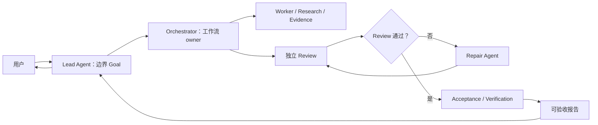
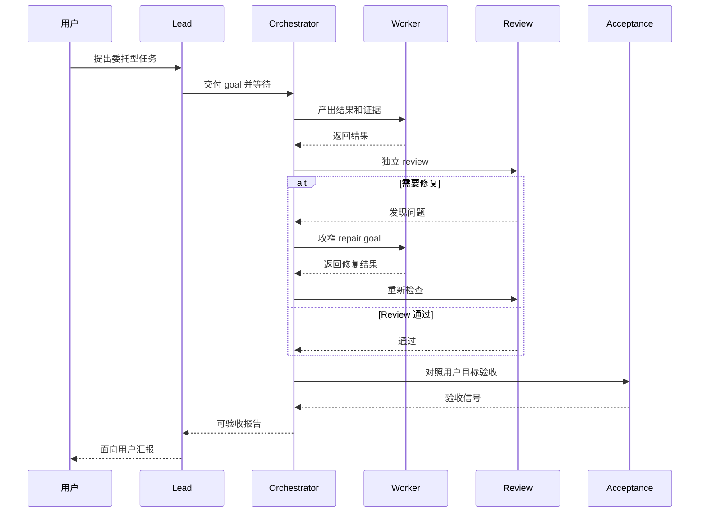

# Parallel Goal Workflows

**[English README](README.md)**

`parallel-goal-workflows` 是一个面向多 Agent 协作的 Skill。它引导 Lead
Agent 启动 Orchestrator，持有会话层面的边界 Goal，以接近 callback 的节奏等待，
并在 Orchestrator 负责 worker、review、acceptance 和 repair 后向用户汇报。

## 安装

```bash
npx skills add patrick-fu/parallel-goal-workflows
```

后续更新：

```bash
npx skills update
```

## 适用场景

- Lead 不应该变成隐藏 worker 的委托工作流
- fan-out / fan-in 形式的并行 Agent 工作和独立 review
- 由 Orchestrator 负责验收和 repair loop
- 宿主环境支持时的嵌套 subagent workflow
- Codex nested subagents 的配置建议

## 工作流形态



## Review 和 Repair Loop



## 包含的 Skill

- `parallel-goal-workflows`

## 说明

这个 Skill 刻意保持指导性：它提供上下文和职责边界，而不是把每个 Agent 的行为写成
刚性脚本。
