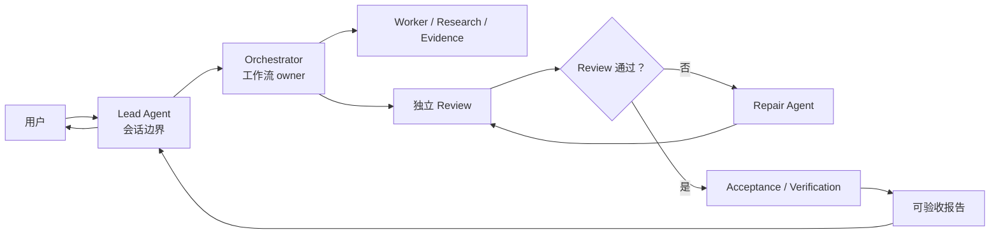
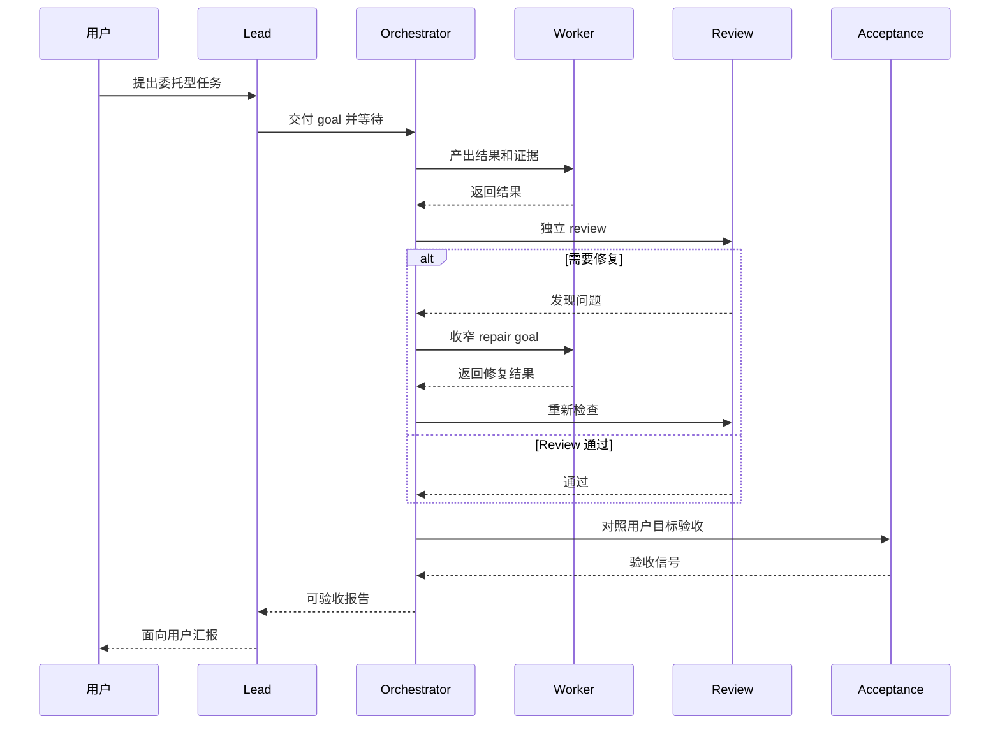

# Parallel Goal Workflows

**[English README](README.md)**

`parallel-goal-workflows` 是一个面向多 Agent 委托工作的指导型 Skill。它帮助
Lead Agent 把工作流所有权交给 Orchestrator，自己留在会话边界上，避免亲自下场执行，
并最终接收一份可验收报告，而不是吞下所有中间细节。

## 它能做什么

这个 Skill 会把一个宽泛的委托任务变成 Orchestrator 负责的工作流：

- Lead Agent 只负责用户会话和最终汇报；
- Orchestrator 负责拆解任务、调度、review、验收和 repair 路由；
- Worker、Review、Acceptance、Repair、Synthesis 等 Agent 分别拿到聚焦的 goal；
- Lead 以接近 callback 的节奏等待，而不是频繁轮询或把工作抢回来；
- 在宿主环境支持嵌套 subagent 时，worker agent 可以按需继续向下委派。

核心思路是 context, not control。这个 Skill 不是刚性脚本，而是给 Agent 足够清晰的
职责边界，让工作流 owner 能根据任务实际情况灵活组织执行。

## 什么时候使用

当任务适合交给多个 Agent，但你不希望主会话变成协调工作区时，可以使用这个 Skill。

典型场景包括：

- 并行 code review、代码库审计、交叉验证式 research；
- 需要独立 worker 和 review 的多步骤实现计划；
- 长时间命令或 Sub Agent 工作，Lead 容易频繁轮询、打断或重启；
- review 和 repair loop 很重要，但主上下文只应该接收最终判断和证据；
- worker 可能还需要继续派生下级 worker 的嵌套 subagent workflow。

## 工作流形态



## Review 和 Repair Loop



## 为什么有用

### 抑制 Lead Agent 抢占工作的倾向

Main/Lead Agent 在完成委派后，经常很难保持观察状态。它可能会忍不住亲自做同一件事、
频繁轮询进度，或者一看到命令/Sub Agent 响应稍慢，就停止、关闭并重来。

这个 Skill 会给 Lead Agent 一个自己的边界 goal：启动 Orchestrator，以接近 callback 的
节奏等待，必要时转发用户补充信息，最后汇报结果，但不变成隐藏 worker。

### 用 Orchestrator 隔离上下文噪声

常规 Sub Agent 工作流里，Main Agent 往往仍然要吸收 review、验收、repair 判断和大量
中间发现。这些内容会持续侵占主上下文窗口。

在这个 Skill 中，二级 Orchestrator 负责吸收这些工作。Lead 只接收最终报告、关键证据和
剩余风险，而不是把杂乱的协调过程全部装进自己的上下文。

### 保持灵活编排

一些 Dynamic Workflow 系统会把计划写进代码，让运行时执行大规模、可复用的 fan-out。
这个 Skill 刻意更轻：它把计划保留在 agent goal 和职责边界里。适合你想复用一种协作偏好，
而不是生成一段 workflow 脚本的场景。

## 使用要求

要完整发挥嵌套工作流效果，宿主环境必须支持多层级 Sub Agent。

- **Codex:** 参考 [Codex subagents 文档](https://developers.openai.com/codex/subagents)
  和 [config basics](https://developers.openai.com/codex/config-basic)。Codex 文档说明
  `agents.max_depth` 控制 spawned agent 的嵌套深度，并且默认 `max_depth = 1` 会阻止更深层级的嵌套。
  一个实用的起始配置是：

  ```toml
  [agents]
  max_threads = 50
  max_depth = 5

  [features]
  multi_agent = true
  ```

- **Claude Code:** 请使用 `2.1.172` 或更新版本。官方
  [Claude Code changelog](https://code.claude.com/docs/en/changelog#2-1-172)
  明确写明 v2.1.172 开始支持 sub-agents 再 spawn 自己的 sub-agents，最多 5 层。
  可以这样检查本地版本：

  ```bash
  claude --version
  ```

## 安装

```bash
npx skills add patrick-fu/parallel-goal-workflows
```

后续更新：

```bash
npx skills update
```

## 包含的 Skill

- `parallel-goal-workflows`

## 更多 Skills

更多可复用的 Agent Skills 可以看
[Awesome Skills](https://github.com/patrick-fu/awesome-skills/blob/main/README.zh-CN.md)。
里面还包括 brainstorm、coding-agent 委托、code review、commit message、goal contract、
学习教练、home config sync 和 log-driven debugging 等 Skills。

## 参考资料

- [Codex subagents](https://developers.openai.com/codex/subagents)
- [Codex config basics](https://developers.openai.com/codex/config-basic)
- [Claude Code dynamic workflows](https://code.claude.com/docs/en/workflows)
- [Claude Code changelog](https://code.claude.com/docs/en/changelog#2-1-172)
- [Anthropic: Building Effective Agents](https://www.anthropic.com/engineering/building-effective-agents)
